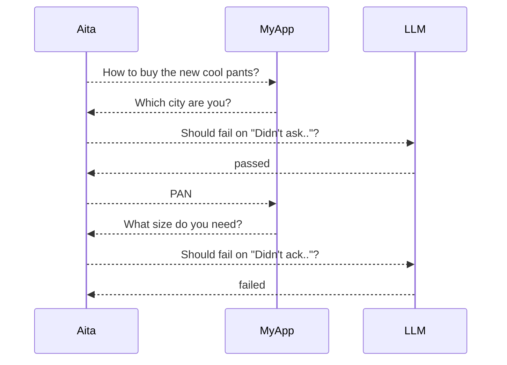

A cli tool running test against an API to see if it replies as expected.

## Run as `aita` command

This repo includes a launcher script at `bin/aita`.
It always runs with the Python interpreter from `.venv` in the project root.

Use it directly from the project root:

```bash
./bin/aita --help
./bin/aita run tests/
```

If you want to type `aita` from this repo without `./bin/`, add `bin/` to your `PATH`:

```bash
export PATH="$(pwd)/bin:$PATH"
aita --help
```

The assert for each round is done by an LLM who does a simple check: does the reponse meet the `fail-on` criteria? If it does, fail, otherwise pass.


# Quick glance

Given a test:
```yaml
name: Unresolvable Alias
endpoint: http://ai.myapp.com/sales/
asserter:
  url: https://api.groq.com/openai/v1/chat/completions
  api-key: ${LLM_API_KEY}
pre-test:
  - /script/init-db.sql
post-test:
    /script/init-db.sql
rounds:
  - input: How to buy the new cool pants?
    expected: 
      response: Which city are you?
      fail-on: Didn't ask for the city
  - input: LS
    expected: 
      response: Your reply is ambiguous, please say the full name of the city
      fail-on: Didn't acknowledge user the ambiguity
  - input: I said "LZ"!
    expected: 
      response: Sorry, do you mean "LA"?
```

Aita works as something like:



The 3rd round won't run because test failed at round 2.

# Configuration

Refer to the root [aita.yaml](aita.yaml)

Notes:

1. multiple test files can be grouped in a directory to be a testsuite.
2. test files of a testsuite share the common configure of tests.
   The shareable configures are `endpoint, asserter, pre-test, post-test`.
   The configure is a yaml file (hardcoded) named `aita.yaml` in the testsuite folder.
3. A test file can have multiple tests seperated by document separator, ie., `---`
4. The only required keys in the test are `name, rounds, rounds[].input`.
5. If `rounds[].expected` is absent, that round will be skipped by the llm asserter
   - sometime you need a round just for preparing the backend state for asserting the next round. So no need to check the reply  
6. There must be a global configure, named `aita.yaml`,
   in the root of the working directory, as the default for all testsuites.
   Aita will panic when this global configure is absent