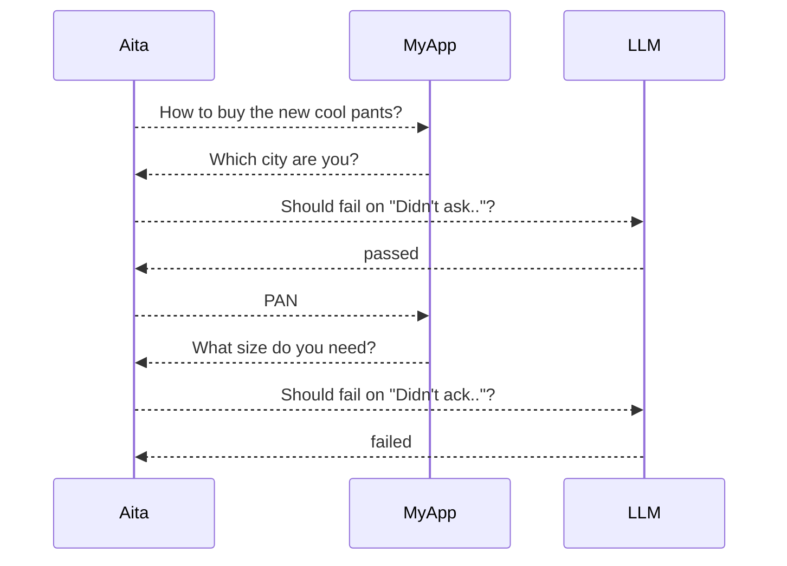

A cli tool running test against an AI assistant API to see if it replies as expected.
The whole point is it relies on a LLM to assert the test output.

Note:

Currently aita assume an envelop json schema on the response of the API, as the following:

```clojure
{:answer "..."
 :metadata {...}
 :status {:kind :ok|:error :msg "..."?}
 :session_id "..."?}
```

The `metadata` is freestyle custom object depend on the context.

# Test organizing

Aita organizes tests in test file and testsuites.

A test file is a yaml file for a single test(with multiple rounds).
A testsuite is a directory storing one or more tests.
Tests in the same testsuites share the same test configures, ie., the `aita.yaml`.
A test can override parent(testsuites or top level) configures by having them directly in its yaml file.

## Hook isolation

`pre-test` and `post-test` hooks have two scopes with different isolation semantics:

- **Suite-level hooks** — defined in a testsuite's `aita.yaml` (or inherited from the global `aita.yaml` as a fallback). These run **once per testsuite**: before the first test in the suite starts, and after the last test in the suite finishes. The working directory is the testsuite directory.
- **Per-test hooks** — defined directly in a test yaml file. These run **once per test**: before and after that individual test. The working directory is also the testsuite directory (the directory containing the test file), so `./` refers to the suite dir and `../` refers to the project root.

This means if suites A and B each need different DB fixtures, put the seed/clean scripts in their respective `aita.yaml` files and the DB will be set up once for each suite, not once per test file.

The global `aita.yaml` `pre/post-test` is purely a configuration fallback — it provides the hook commands for any suite that does not define its own. The isolation boundary is always the suite, regardless of where the hook string originates.

# Test yaml file

A "test" is writen in a yaml file of its own, with following fields:

- `name` - The name of the test used in test report
- `pre-test` - shell script as pre test hook
- `post-test` - shell script as post hook
- `rounds` - list of round object for input ans expected
- configuration - test environment setup options, e.g., `login-required`.

Example:

```yaml
name: Unresolvable Alias

endpoint: http://ai.myapp.com/sales/   # Configure test target
login-required: false                  # Configure login mode
                                       
pre-test:                              # 
  - /script/init-db.sh                 # pre hook for DB data
post-test:                             #
  - /script/clean-db.sh                # post hook reset db

rounds:
  - input: How to buy the new cool pants?
    expected: 
      response: Which city are you?
      fail-on: Didn't ask for the city
  - input: LS
    expected: 
      response: >
        Your reply is ambiguous,
        please say the full name of the city
      fail-on: Didn't acknowledge user the ambiguity
  - input: I said "LZ"!
    expected: 
      response: Sorry, do you mean "LA"?
```

# Rounds

A round is a request-response round on the target endpoint which is checked by aita.
Each round has a required `input` for user intput text, and an optional `expected` object for the `asserter`(see later below) to check if the actual response is as the expected value. If `expected` is absent, aita will make the request but ignore the output, i.e., it will go to next round directly.

`expected` object:

- `response` - Optional text replied from the target enpoint for the input. LLM assertion will be skipped if this is absent
- `fail-on`: The LLM prompt for checking if the response is expected
- `status-code`: assert HTTP status code. Defaults to `200` when `expected` is present.
- `status-kind`: assert JSON `status.kind`. Defaults to `"ok"` when `expected` is present.
- `has-session-id`: assert whether JSON `session_id` exists
- `metadata-has`: assert listed keys exist in JSON `metadata`

Note that `response + fail-on` is non-deterministic LLM assertion while all others are deterministic ones.
These deterministic checkes will run before LLM assertion. If they failed, LLM assertion will never run.

# Configuration

- `endpoint` - Required. The test target, e.g., `http://ai.myapp.com/sales/`
- `login-required` - default false. When true, runs an explicit authentication bootstrap before rounds, then reuses cookies for all rounds.
  The value of `login-required` is scoped. For example, if testsuite "tsA" is `login-required=true` and
  "tsB" is `login-required=false`, an authentication process will be run to setup the login cookie for tsA
  which will be share across all tests in tsA. But that is not the case for "tsB" - all the tests in tsB
  will still be run in anonymous mode. Aita will seperate the login context for these two testsuites.
- `authentication` - an object used for authentication bootstrap, required only when `login-required=true`.
- `authentication.path` - default to `/api/login`, the path of login. shares the same origin as the target endpoint
- `authentication. method` - default `POST`
- `authentication.headers` - login headers passed to login path as-is, default `Content-Type: application/x-www-form-urlencoded`
- `authentication.body` - body object of the login request, e.g., `{"email": "${TEST_USER_EMAIL}", "password": "${TEST_USER_PASSWORD}"}`
- `asserter` - An object of the LLM service for asserting the `expected.output`. Required if there are LLM-asserting rounds
- `asserter.url` - requied, e.g., "https://api.groq.com/openai/v1/chat/completions"
- `asserter.api-key` - e.g., `${LLM_API_KEY}`
- `asserter.invoke-options` - an object for any other options the asserter supports, will be passed as-is to the LLM call.

These configurations can live in multiple places, with override precedence as:

- Test yaml file
- the `aita.yaml` in the testsuite dir
- the `aita.yaml` in the current dir, ie., the global configure

## Merge strategy

Different keys use different merge strategies across the three levels:

| Key | Strategy |
|---|---|
| `endpoint` | Last-wins: test > suite > global |
| `login-required` | Last-wins: test > suite > global |
| `asserter` | Deep merge: sub-keys are merged individually across all three levels; `invoke-options` entries are shallow-merged (lower level sets the base, higher levels override individual keys) |
| `authentication` | Deep merge: sub-keys (`path`, `method`, `body`) use last-wins; `headers` entries are shallow-merged |
| `pre-test` / `post-test` | Not merged. Suite/global hooks are suite-level (run once per suite). Per-test hooks come exclusively from the test file and never inherit from parent configs. |

**Example — `authentication` deep merge:**

`aita.yaml` (global):
```yaml
authentication:
  path: /api/login
  headers:
    Content-Type: application/json
```
`suite/aita.yaml`:
```yaml
authentication:
  headers:
    Content-Type: text/html
```
Effective result: `path: /api/login` is preserved from global; `Content-Type` is overridden to `text/html` by the suite.

**Note on `.env`:** Aita loads `.env` from the project root — the nearest ancestor directory containing a global `aita.yaml`, found by walking up from the first target path. This is independent of the directory from which the `aita` command is launched.


# Test Examples

## Example-1: LLM asserts reply

`aita.yaml`:
```yaml
endpoint: http://localhost:3000/api/chat
login-required: false
```
`anonymous-plan-1st-reply.yaml`:
```yaml
name: first reply for plan is asking for target country
rounds:
  - input: 请帮我做留学规划
    expected:
      response: 请问您想去哪个国家？
      fail-on: 没有询问用户想去哪个国家
```

## Example-2: deterministic assertion in logged-in mode

```yaml
name: logged-in chat flow
endpoint: http://localhost:3000/api/chat
login-required: true
authentication:
  path: /api/login
  method: POST
  headers:
    Content-Type: application/json
  body:
    email: ${TEST_USER_EMAIL}
    password: ${TEST_USER_PASSWORD}
rounds:
  - input: 帮我生成申请时间线
    expected:
      metadata-has:
        - actions
```

# Run as `aita` command

This repo includes a launcher script at `bin/aita`.
It always runs with the Python interpreter from `.venv` in the project root.

Use it directly from the project root:

```bash
./bin/aita --help
./bin/aita tests/
```

If you want to type `aita` from this repo without `./bin/`, add `bin/` to your `PATH`:

```bash
export PATH="$(pwd)/bin:$PATH"
aita --help
aita foo bar/baz.yaml
aita --all
```

# Timeout behavior

The commandline option `--timeout` applies to all outbound HTTP calls:

1. login bootstrap request (`authentication`)
2. target app chat endpoint call (each round)
3. LLM asserter call

What happens on timeout:

1. Round chat timeout or LLM timeout:
  - current test is marked `ERRORED`
  - remaining rounds in that test stop
  - `post-test` hooks still run
  - run continues to next test
2. Login bootstrap timeout:
  - run stops immediately with exit code `2`
  - Aita prints the error message
  - this happens before entering test rounds for that identity context

Note: `--timeout` does not apply to shell hooks (`pre-test`/`post-test`).

# Environment Variables

Environment variables in YAML (`${VAR}`) are resolved from process env.
At runtime, Aita also auto-loads `.env` from the current working directory root before parsing YAML.
Existing process env values win over `.env` values when both define the same key.


# How Aita works

Given a test:
```yaml
name: Unresolvable Alias
endpoint: http://ai.myapp.com/sales/
asserter:
  url: https://api.groq.com/openai/v1/chat/completions
  api-key: ${LLM_API_KEY}
pre-test:
  - /script/init-db.sh
post-test:
    /script/clean-db.sh
rounds:
  - input: How to buy the new cool pants?
    expected: 
      response: Which city are you?
      fail-on: Didn't ask for the city
  - input: LS
    expected: 
      response: Your reply is ambiguous, please say the full name of the city
      fail-on: Didn't acknowledge user the ambiguity
  - input: I said "LZ"!
    expected: 
      response: Sorry, do you mean "LA"?
```

Aita works as something like:



The 3rd round won't run because test failed at round 2.
