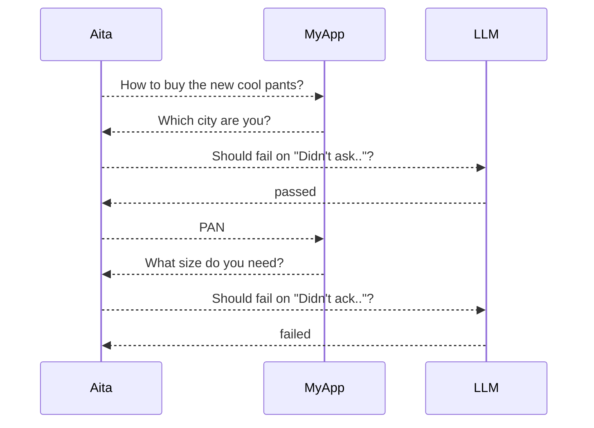

Given a test:
```yaml
name: Unresolvable Alias
endpoint: http://my.MyApp.com/chat/
pre-test:
  - /script/init-db.sql
post-test:
    /script/init-db.sql
rounds:
  - input: How to buy the new cool pants?
    expected: 
      response: Which city are you?
      fail-on: Didn't ask for the city
  - input: PAN
    expected: 
      response: Your reply is ambiguous, please say the full name of the city
      fail-on: Didn't acknowledge user the ambiguity
  - input: I said "PEN"!
    expected: 
      response: Sorry, please say the full name
```

aita works as something like:



The 3rd round won't run because test failed at round 2.

