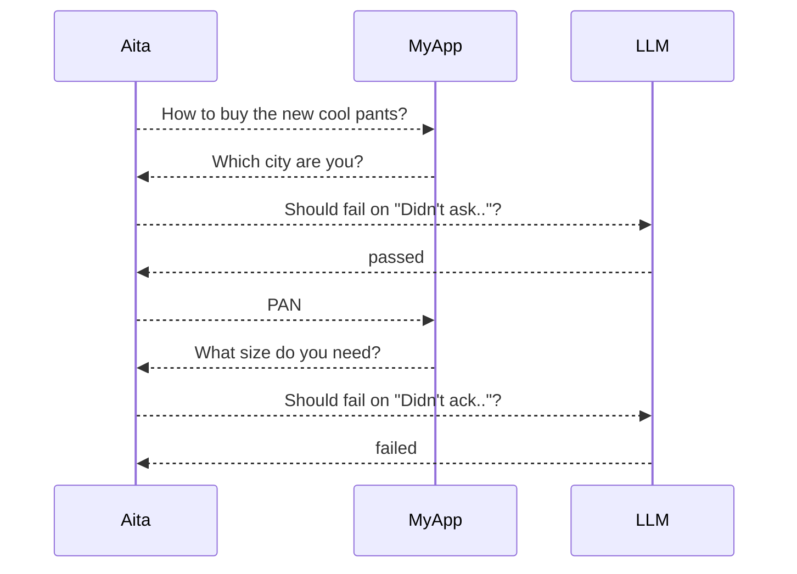

A cli tool running test against an AI assistant API to see if it replies as expected.
The whole point is it relies on a LLM to assert the test output.

## Identity and auth (v1)

Aita supports test-level identity modes for chat testing:

- `legacy`: old behavior (stateless requests, no automatic auth/session handling)
- `anonymous`: auto-persist `session_id` from response JSON, and auto-send it on later rounds
- `logged-in`: run an explicit auth bootstrap request before rounds, then reuse cookies for all rounds

### YAML fields

New top-level test fields:

- `identity.mode` (`legacy | anonymous | logged-in`)
- `identity.auth-request` (required when mode is `logged-in`)

For v1, each round always targets the top-level chat endpoint.
`identity.auth-request` is only for login bootstrap before rounds.

If `identity` is defined in a testsuite `aita.yaml`, all tests in that suite share it.
For `logged-in` mode, Aita reuses one authenticated runtime context per shared identity config
within one `aita run` execution (login is not repeated per test case).

### Deterministic assertions

Inside `rounds[].expected`, these deterministic checks run before LLM assertion:

- `status-code`: assert HTTP status code
- `status-kind`: assert JSON `status.kind`
- `has-session-id`: assert whether JSON `session_id` exists
- `metadata-has`: assert listed keys exist in JSON `metadata`

If `response` and `fail-on` are both omitted, Aita runs deterministic assertions only and skips LLM assertion.

### Example: anonymous continuity

```yaml
name: anonymous chat keeps continuity
endpoint: http://localhost:3000/api/chat
identity:
  mode: anonymous
rounds:
  - input: 请帮我做留学规划
    expected:
      status-code: 200
      status-kind: ok
      has-session-id: true
      fail-on: 没有理解用户意图
  - input: 我目标是英国硕士
    expected:
      status-code: 200
      status-kind: ok
      has-session-id: true
```

### Example: logged-in with bootstrap request

```yaml
name: logged-in chat flow
endpoint: http://localhost:3000/api/chat
identity:
  mode: logged-in
  auth-request:
    endpoint: http://localhost:3000/api/login
    method: POST
    headers:
      Content-Type: application/json
    body:
      email: ${TEST_USER_EMAIL}
      password: ${TEST_USER_PASSWORD}
rounds:
  - input: 帮我生成申请时间线
    expected:
      status-code: 200
      status-kind: ok
      metadata-has:
        - actions
```

## Run as `aita` command

This repo includes a launcher script at `bin/aita`.
It always runs with the Python interpreter from `.venv` in the project root.

Use it directly from the project root:

```bash
./bin/aita --help
./bin/aita run tests/
```

If you want to type `aita` from this repo without `./bin/`, add `bin/` to your `PATH`:

```bash
export PATH="$(pwd)/bin:$PATH"
aita --help
```

The assert for each round is done by an LLM who does a simple check: does the reponse meet the `fail-on` criteria? If it does, fail, otherwise pass.

Environment variables in YAML (`${VAR}`) are resolved from process env.
At runtime, Aita also auto-loads `.env` from the current working directory root before parsing YAML.
Existing process env values win over `.env` values when both define the same key.


# How Aita works

Given a test:
```yaml
name: Unresolvable Alias
endpoint: http://ai.myapp.com/sales/
asserter:
  url: https://api.groq.com/openai/v1/chat/completions
  api-key: ${LLM_API_KEY}
pre-test:
  - /script/init-db.sh
post-test:
    /script/clean-db.sh
rounds:
  - input: How to buy the new cool pants?
    expected: 
      response: Which city are you?
      fail-on: Didn't ask for the city
  - input: LS
    expected: 
      response: Your reply is ambiguous, please say the full name of the city
      fail-on: Didn't acknowledge user the ambiguity
  - input: I said "LZ"!
    expected: 
      response: Sorry, do you mean "LA"?
```

Aita works as something like:



The 3rd round won't run because test failed at round 2.

# Configuration

Refer to the root [aita.yaml](aita.yaml)

Allowed keys in `aita.yaml` (global or testsuite):

1. `endpoint`
2. `asserter`
3. `identity`
4. `pre-test`
5. `post-test`

Allowed keys in test documents (for example `foo-test.yaml`):

1. `name` (required)
2. `rounds` (required)
3. all keys in `aita.yaml` as optionals, to override

Round-level keys:

1. `input` (required)
2. `expected` (optional)
3. `expected.response` (optional)
4. `expected.fail-on` (optional)
5. `expected.status-code` (optional)
6. `expected.status-kind` (optional)
7. `expected.has-session-id` (optional)
8. `expected.metadata-has` (optional)

Override precedence is explicit:

1. test document (for example `foo-test.yaml`)
2. testsuite `aita.yaml`
3. global `aita.yaml` at current working directory root

Additional notes:

1. Multiple test files can be grouped in one directory as a testsuite.
2. A test file can contain multiple documents separated by `---`.
3. If `rounds[].expected` is absent, that round skips LLM assertion.
4. A global `aita.yaml` in current working directory root is required.